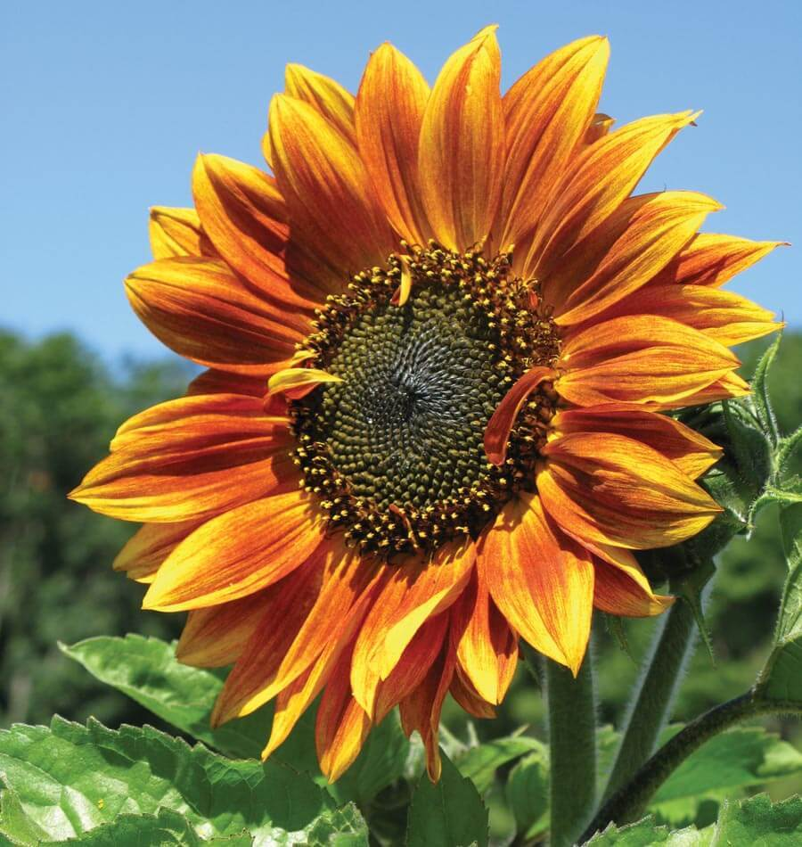
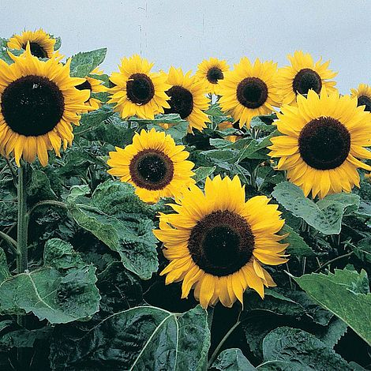
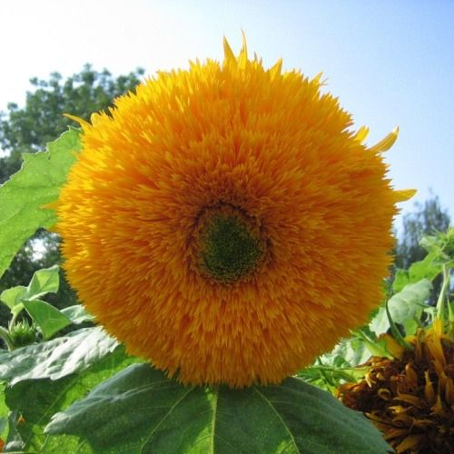

# K-means-img-sorting
Images sorting with K-means
Cluster images, please dont forget to change the directory where the files are uploaded and the where the resized images are saved.
## Images
Sunflower

  
  
  
  
  
  
  
  
  
  

Daisy

  
  
  
  
  
  
  
  
  
  

Roses

  
  
  
  
  
  
  
  
  
  

## Result
1) Three centroids are chosen since there are three different type of flowers.

2) The initial values for the 3 centroids are randomly chosen from the 30 images of flowers.

3) The model is run for 100 times with each time the values for the 3 centroids chosen randomly.

4) At each run, the iteration is carried out 10 times to find the optimum sum square diffrence between the images and centroids.

5) The number of iteratiosn required to reach optimality is tracked using variable "*itrlist*".

6) The sum difference of the optimimum distance of all images to its centroids is tracked using variabe "*errlist*".

The table below show the values of the key criterias that were tracked and calculated.

| Criteria | itrlist | errlist|
| --- | --- | --- |
| Min | 1 | 111126 |
| Max | 9 | 124831 |
| Average | 2.69 | 116300.95 |
| Standard Deviation | 1.37 | 3103.11 |

The optimum classification for the images are shown in the figures below:

Class 1

Class 2

Class 3

